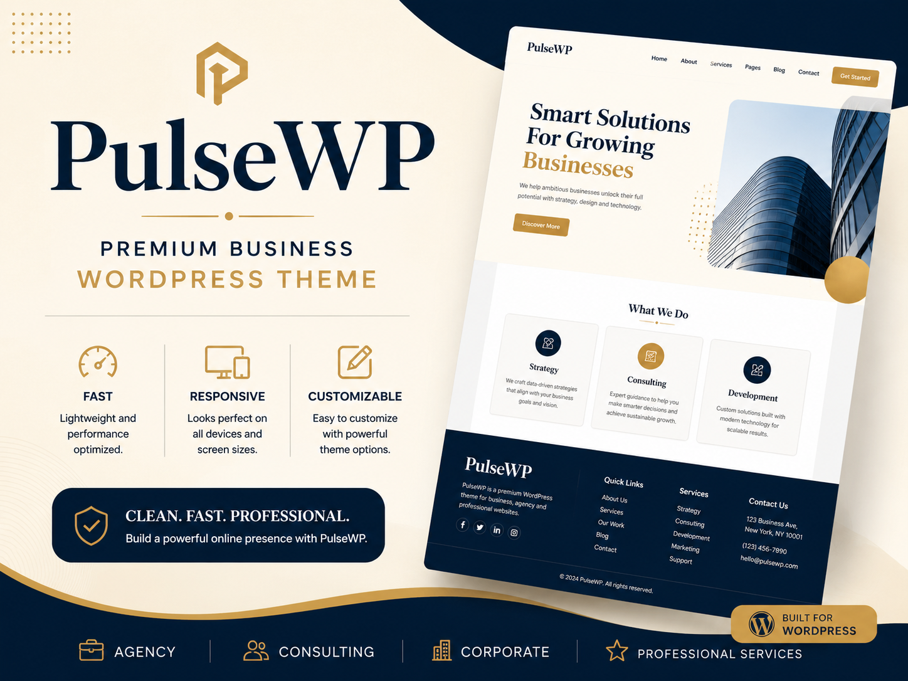
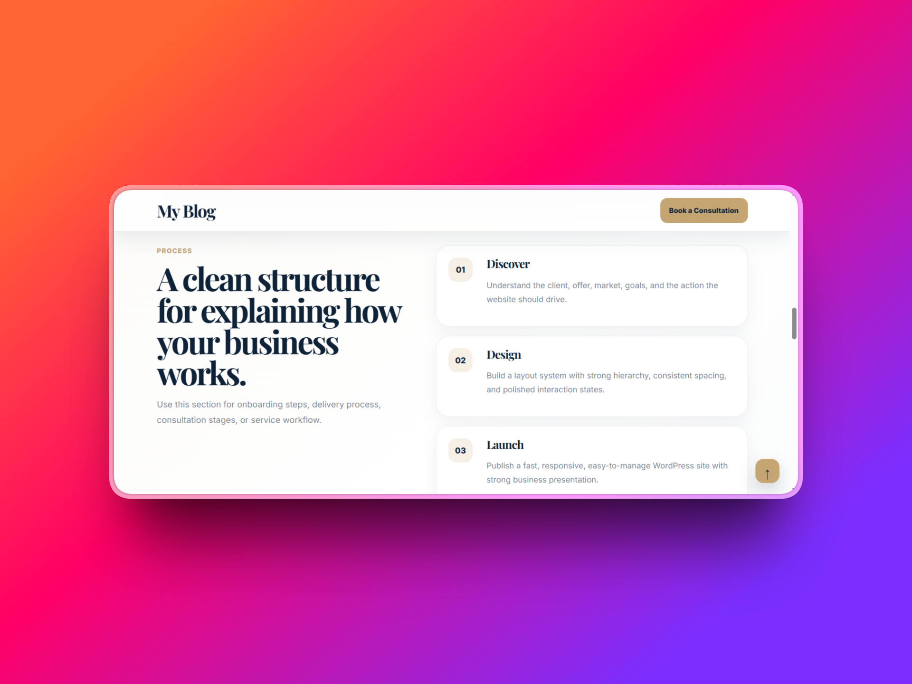

# PulseWP



A lightweight premium WordPress theme built for agencies, consultants, professional services, corporate websites, finance businesses, and modern business landing pages.

PulseWP combines polished design, refined typography, responsive layouts, and WordPress-native customization while remaining lightweight, builder-friendly, and easy to maintain.

> Installable theme package available in:
>
> `release/pulsewp.zip`

---

# Preview




---

# Overview

PulseWP was built as a lightweight business-focused WordPress theme that provides a polished foundation without the overhead commonly found in large multipurpose themes.

The project aims to deliver a professional out-of-the-box experience while remaining flexible enough for Elementor, Gutenberg, and custom page-builder workflows.

Suitable for:

* Agencies
* Consulting firms
* Professional services
* Finance businesses
* Corporate websites
* Marketing companies
* Freelancers
* One-page websites
* Business landing pages

---

# Design Philosophy

PulseWP follows five principles:

* Lightweight
* Fast
* Professional
* Builder-friendly
* WordPress-native

The goal is to provide a theme similar in spirit to Hello Elementor while offering a more refined visual experience through typography, layouts, forms, navigation, and business-oriented styling.

---

# Features

## Layout & Navigation

* Responsive design
* Mobile navigation drawer
* Sticky header support
* Custom footer
* Widgetized footer columns
* Sidebar support
* Back-to-top button
* Multiple menu locations

## Content & Blogging

* Homepage template
* Blog archive template
* Single post template
* Search template
* 404 template
* Standard page template
* Full Width template
* Blank Canvas template

## Customization

* WordPress Customizer integration
* Theme color controls
* Header CTA controls
* Footer customization
* Homepage section controls
* Sticky header toggle
* Custom logo support

## Gutenberg Support

* Theme JSON integration
* Editor styling
* Wide alignment support
* Responsive embeds
* Appearance tools support
* Editor color palette

## Form & Plugin Styling

PulseWP includes styling support for:

* Contact Form 7
* WPForms
* Gravity Forms
* Formidable Forms
* Native WordPress forms

Styled components include:

* Inputs
* Textareas
* Select fields
* Labels
* Validation states
* Buttons
* Search forms

---

# Templates Included

## Homepage

Business-focused homepage featuring:

* Hero section
* Services section
* Statistics section
* Process section
* Case studies
* Testimonials
* Call-to-action blocks

## Full Width Template

Ideal for:

* Landing pages
* Marketing pages
* Sales pages
* Custom layouts

## Blank Canvas Template

Ideal for:

* Elementor
* Gutenberg page building
* Builder-heavy websites
* Custom landing pages

---

# Color Palette

### Primary

```css
#0E2238
```

Deep navy blue used throughout the theme.

### Accent

```css
#C5A572
```

Premium gold accent color.

### Background

```css
#F8F6F0
```

Soft cream background.

### Secondary Background

```css
#EEF2F6
```

Light neutral surface color.

---

# Typography

### Display Typeface

```text
Playfair Display
```

Used for:

* Hero titles
* Major headings
* Featured content

### Body Typeface

```text
Inter
```

Used for:

* Paragraphs
* Navigation
* Forms
* Interface elements

---

# Repository Structure

```text
.
├── pulsewp/
│   ├── assets/
│   │   ├── css/
│   │   └── js/
│   ├── inc/
│   ├── template-parts/
│   ├── screenshot.png
│   ├── style.css
│   ├── functions.php
│   ├── theme.json
│   ├── header.php
│   ├── footer.php
│   ├── index.php
│   ├── front-page.php
│   ├── page.php
│   ├── single.php
│   ├── archive.php
│   ├── search.php
│   ├── 404.php
│   ├── searchform.php
│   ├── template-full-width.php
│   └── template-blank-canvas.php
│
├── assets/
│   └── screenshots/
│       ├── screenshot1.png
│       ├── screenshot2.png
│       └── screenshot3.png
│
└── release/
    └── pulsewp.zip
```

---

# Installation

1. Download:

```text
release/pulsewp.zip
```

2. Login to WordPress Admin.

3. Navigate to:

```text
Appearance → Themes
```

4. Click:

```text
Add New Theme
```

5. Upload:

```text
pulsewp.zip
```

6. Activate PulseWP.

---

# Technical Highlights

* Built from scratch
* WordPress-native architecture
* Theme JSON integration
* Customizer integration
* Responsive design system
* Builder-friendly templates
* Plugin-friendly styling
* Lightweight structure
* No external theme frameworks
* No bundled premium dependencies

---

# Performance Goals

PulseWP was designed around:

* Minimal overhead
* Fast rendering
* Clean CSS architecture
* Reduced complexity
* Builder compatibility
* Long-term maintainability

---

# License

MIT License.

---

# Author

Williams

GitHub: https://github.com/wbizmo

---

# Version

Current Version: **1.0.0**
